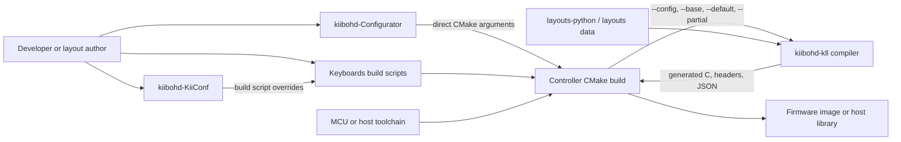
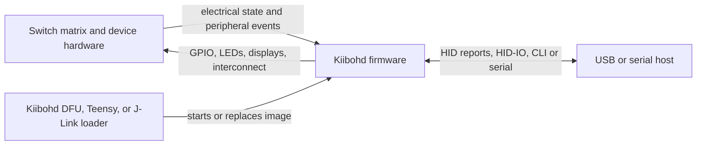
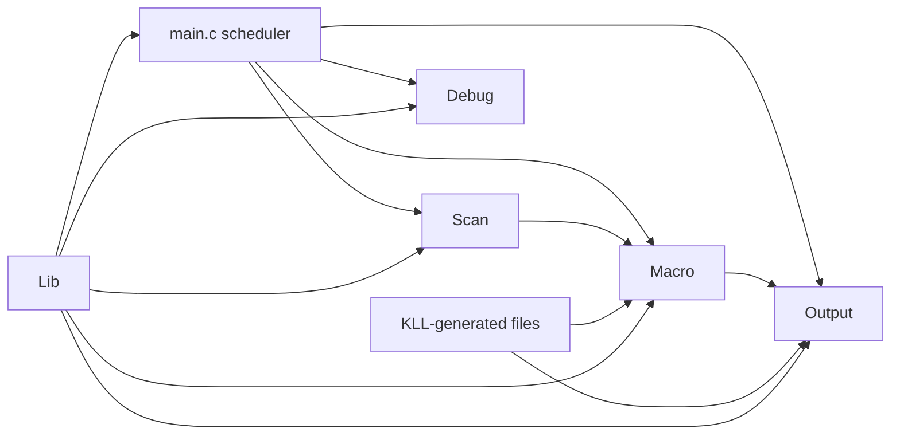
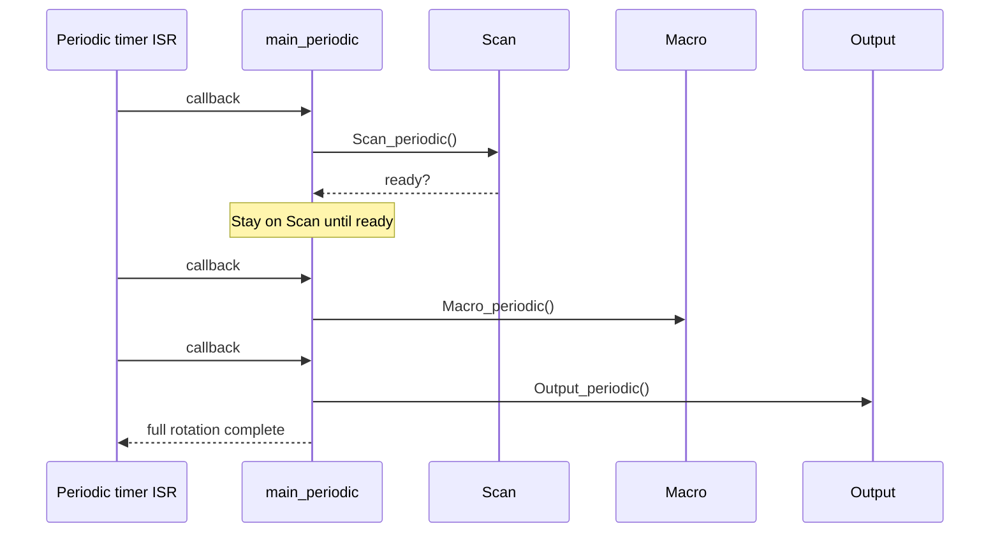
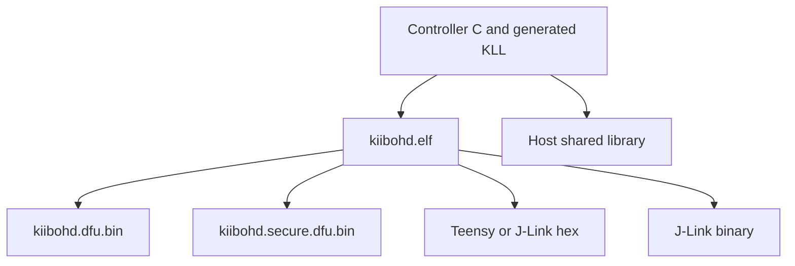

# Kiibohd Controller architecture

This document describes the architecture of the Kiibohd keyboard firmware and
its build system using the arc42 sections. It reflects the repository at the
time of writing; individual keyboard modules and deprecated ports may differ.

## 1. Introduction and goals

### Purpose

Kiibohd Controller builds firmware that scans keyboard hardware, interprets
Keyboard Layout Language (KLL) mappings and macros, and reports the resulting
actions to a host, normally over USB HID. The same core logic can be built as a
host shared library for automated tests.

### Primary goals

1. **Deterministic input handling.** Matrix and device scanning must receive
   regular service, then macro processing and output reporting must occur in a
   predictable order.
2. **Compile-time configurability.** A build selects one main module from each
   of Scan, Macro, Output, and Debug, plus any submodules declared by those
   modules.
3. **Layout programmability.** KLL source from devices, modules, base maps, a
   default map, and partial layers is compiled into firmware data and code.
4. **Hardware portability.** MCU, board, scanner, output transport, and loader
   differences are isolated behind CMake selection and module interfaces.
5. **Testability without hardware.** Host builds substitute TestIn and TestOut,
   expose the firmware core as a shared library, and drive it from Python.
6. **Small embedded footprint.** Generated data widths, selected modules,
   section garbage collection, and size checks conserve limited RAM and flash.

### Stakeholders

- Keyboard users need correct, low-latency input and reliable firmware images.
- Layout authors need KLL layers and capabilities to compile consistently.
- Board and firmware developers need replaceable hardware modules and debug
  facilities.
- Configurator developers need a stable CMake/KLL build contract.
- Release maintainers need reproducible multi-board builds and flashable
  artifacts.

## 2. Architecture constraints

### Technical constraints

- Production firmware is C for resource-constrained MCUs. The maintained
  families in the current build path are Kinetis and SAM Cortex-M4; legacy AVR
  support remains in-tree.
- Cross-compilation primarily uses `arm-none-eabi-gcc`. ARM clang and host
  GCC/clang paths exist, but GCC is the normal firmware compiler.
- CMake selects sources and generates the build. Keyboard-facing Bash scripts
  are the supported convenience entry points and require Bash plus Ninja or
  Make.
- The KLL compiler requires Python 3 and must report at least version
  `0.5.7.16`.
- Firmware has no operating system. Interrupt-backed timing and a cooperative
  main loop provide scheduling.
- CMake build directories are configuration-specific. Changing compiler
  families requires a clean build directory.
- Kinetis and SAM linker scripts, startup code, vendor libraries, USB stacks,
  and bootloader formats constrain deployment.

### Repository and compatibility constraints

- `Keyboards/` owns named product build recipes; it does not contain the core
  runtime. `Lib/` owns common runtime support, toolchain setup, linker scripts,
  and CMake orchestration.
- Module `setup.cmake` files are executable architecture descriptors. They
  declare sources, compiler-family compatibility, KLL capabilities, and
  submodule dependencies.
- Public module entry points (`*_setup`, `*_periodic`, and `*_poll`) are linked
  by convention rather than through a dynamic registry.
- Licensing is per file and includes MIT, GPLv3, public-domain, and third-party
  code. Redistribution must preserve the applicable file-level terms.

## 3. System scope and context

### Build-time context



The Controller has one required sibling dependency:

- **[kiibohd-kll architecture](https://github.com/MarkDrei/kiibohd-kll/blob/master/docs/arc42/index.md)**:
  the KLL compiler transforms layout and capability sources into build inputs.
  With sibling local checkouts its document is
  `../kiibohd-kll/docs/arc42/index.md`.

The following systems consume the Controller build contract:

- **[kiibohd-Configurator architecture](https://github.com/MarkDrei/kiibohd-Configurator/blob/master/docs/arc42/index.md)**:
  the desktop application writes KLL files and runs CMake locally, optionally
  through WSL on Windows. Its local document is
  `../kiibohd-Configurator/docs/arc42/index.md`.
- **[kiibohd-KiiConf architecture](https://github.com/MarkDrei/kiibohd-KiiConf/blob/master/docs/arc42/index.md)**:
  the historical web application maintains Controller and KLL checkouts and
  invokes keyboard scripts server-side. Its local document is
  `../kiibohd-KiiConf/docs/arc42/index.md`.

These configurators are build-time clients. Neither is deployed into the
firmware or required while a keyboard is running.

### Runtime context



The firmware owns no network service and normally persists only explicitly
enabled settings in MCU non-volatile storage. A bootloader or external
programmer installs the build artifact.

## 4. Solution strategy

| Concern | Strategy |
| --- | --- |
| Product variation | Select Scan, Macro, Output, Debug, chip, and maps through CMake cache variables. |
| Hardware composition | Main modules recursively add device or interface submodules through `AddModule`. |
| Layouts and macros | Compile KLL before C compilation and make all generated outputs source dependencies. |
| Scheduling | Split work into timer-driven `periodic` stages and best-effort `poll` work. |
| Portability | Select compiler-family and MCU support in `Lib/CMake`; hide MCU details in `Lib` and Scan devices. |
| Output protocols | Keep action generation in Macro and protocol/transport handling in Output. |
| Verification | Rebuild the same core for the host with TestIn/TestOut and exercise it through Python/ctypes. |
| Delivery | Convert ELF output to DFU binary, secure DFU binary, Intel HEX, or J-Link images as appropriate. |

The dominant architectural pattern is a statically composed processing
pipeline:

```text
physical/input event -> Scan -> Macro/KLL -> Output -> host
```

Composition happens at configure and compile time. There is no runtime plugin
loading.

## 5. Building block view

### Level 1: top-level blocks



- **`main.c`** initializes services and modules, then coordinates periodic and
  polling work.
- **`Scan/`** turns matrix positions, protocol input, and device events into
  logical key indices. A board-specific main Scan module may compose drivers
  from `Scan/Devices/`.
- **`Macro/`** is the event engine. `PartialMap` implements KLL
  trigger/result processing and layers; `PixelMap` adds pixel control.
- **`Output/`** translates current results to USB HID, HID-IO, UART, RTT, or
  test callbacks. Main Output modules can compose common interfaces.
- **`Debug/`** provides CLI, printing, latency measurement, LEDs, and tracing.
- **`Lib/`** contains MCU and host support, timing, storage, compatibility
  headers, vendor libraries, linker scripts, and the CMake implementation.
- **`Bootloader/`** is a separately built deployment component. It is related
  to the firmware image format but is not linked into the normal controller
  target.

### Level 2: build-time composition

1. A script in `Keyboards/` defines product defaults such as `ScanModule`,
   `MacroModule`, `OutputModule`, `DebugModule`, `Chip`, `BaseMap`,
   `DefaultMap`, and `PartialMaps`.
2. `Keyboards/cmake.bash` creates a configuration-specific out-of-source build
   directory and translates those values into `-D...` CMake arguments.
3. `CMakeLists.txt` loads `Lib/CMake/initialize.cmake`, which maps `CHIP` to
   `avr`, `arm`, or `host` and loads that compiler-family file.
4. `Lib/CMake/modules.cmake` resolves the four main module paths. `AddModule`
   includes each `setup.cmake`, recursively discovers submodules, prefixes
   source paths, checks compiler compatibility, and gathers
   `capabilities.kll`.
5. `Lib/CMake/kll.cmake` resolves and runs the KLL compiler.
6. `Lib/CMake/build.cmake` creates the ELF or host shared library, a static
   library, and target-specific post-build artifacts and loader scripts.

### `Keyboards/` versus `Lib/`

- `Keyboards/` is the product/configuration layer: human-friendly recipes,
  VID/PID choices, board variants, layout names, map selections, batch builds,
  and test entry points.
- `Lib/` is reusable implementation and build infrastructure: MCU startup and
  registers, periodic timing, storage, host shims, compiler flags, linker
  scripts, KLL orchestration, image conversion, and size reporting.
- Board behavior itself belongs in `Scan/<board>` and reusable peripherals in
  `Scan/Devices`; moving these into keyboard scripts would bypass module
  compatibility and source discovery.

### Stable module contracts

The scheduler expects each selected module to provide:

- `Scan_setup`, `Scan_periodic`, and `Scan_poll`;
- `Macro_setup`, `Macro_periodic`, and `Macro_poll`;
- `Output_setup`, `Output_periodic`, and `Output_poll`.

The `periodic` functions advance the input-to-output pipeline. The `poll`
functions handle work that should run as frequently as possible but does not
require the timer cadence. Module-specific callbacks and shared headers carry
events between these stages. Scan modules also expose callbacks such as
`Scan_finishedWithMacro` and `Scan_finishedWithOutput`, allowing downstream
stages to acknowledge consumed input and provide back-pressure.

## 6. Runtime view

### Firmware startup

1. MCU startup code transfers control to `main`.
2. Debug tracing, latency measurement, CLI, and the periodic callback are
   initialized.
3. Optional non-volatile storage is initialized.
4. Modules are initialized in `Output`, `Macro`, `Scan` order so downstream
   consumers exist before input begins.
5. Stored settings are loaded when storage is enabled.
6. The periodic state machine starts at the Scan stage.
7. The foreground loop continuously processes CLI, then Scan, Macro, and
   Output polling functions, and services the watchdog.

### One periodic processing rotation



Scan receives preferential timing: the state machine advances only when
`Scan_periodic()` reports that input is ready. Macro then evaluates generated
KLL tables and scheduled triggers/results. Output packages and sends the
resulting state.

### Host test runtime

For `HostBuild`, CMake substitutes `Scan/TestIn` and `Output/TestOut` while
retaining the selected Macro module. It builds `kiibohd` as a shared library.
`Host_init`, `Host_periodic`, `Host_poll`, and `Host_process` expose the same
control flow. Python tests:

- issue named commands to the library;
- inspect or change exported memory through `ctypes`; and
- receive callbacks for simulated hardware behavior.

This boundary validates KLL scheduling and pixel logic, but it does not emulate
MCU timing, interrupts, USB electrical behavior, or all device drivers.

## 7. Deployment view

### Build environments

- Linux is the principal CI and release environment.
- macOS runs a reduced host-oriented CI path.
- Windows builds use Cygwin/MSYS-style tooling or a Linux environment such as
  WSL when driven by the desktop Configurator.
- Dockerfiles provide the recommended manually managed toolchain environment.

### Target artifacts



- Kiibohd bootloader targets receive a DFU-suffixed binary. Supported Kinetis
  targets may also receive a key-prepended secure DFU binary.
- Teensy targets receive Intel HEX.
- J-Link builds receive binary and HEX images plus generated load/debug
  scripts.
- Host builds produce a platform shared library and a static library.
- Optional `.lss`, `.sym`, linker map, build metadata, and `compile_commands`
  files support diagnostics rather than deployment.

The separately built `Bootloader/` occupies protected flash and transfers
control to the controller image. Linker scripts and per-chip size limits must
agree with its reserved regions.

## 8. Cross-cutting concepts

### KLL compile-time boundary

KLL is a build tool, not a firmware runtime service. `Lib/CMake/kll.cmake`
locates it in this order:

1. an explicitly supplied `KLL_EXECUTABLE`;
2. a compatible in-tree `kll/kll/kll`; or
3. `python3 -m kll`.

The build verifies the compiler version, asks it for its installation and
layout-cache paths, and assembles these source groups:

- `--config`: `capabilities.kll` from selected Scan, Macro, Output, Debug, and
  device modules;
- `--base`: physical scan-code mapping from the selected Scan module;
- `--default`: the base user-visible layout, resolving build-directory files
  before installed layouts and board-local files;
- repeated `--partial`: additional or overlaid layers.

The `kiibohd` emitter writes:

- `generatedKeymap.h` for mappings, triggers, results, and layers;
- `kll_defs.h` for configuration-dependent definitions and widths;
- `usb_hid.h` for HID lookups;
- `generatedPixelmap.c` for pixel mappings; and
- `kll.json` for machine-readable build/layout metadata.

All outputs are attached to the CMake source list and depend on all discovered
KLL inputs, so a relevant layout edit regenerates them before C compilation.
The generated C and headers are compiled into the image; Python and the KLL
compiler are absent at runtime.

When `CONFIGURATOR` is defined, the compiler also receives a
build-local `--preprocessor-tmp-path`. This isolates generated intermediate KLL
files used by configurator-driven builds.

### Configurator build contracts

- KiiConf generates layout KLL files in a temporary build area, sets
  `DefaultMapOverride` and `PartialMapsExpandedOverride`, and invokes the
  relevant `Keyboards/*.bash` recipe with `CMakeExtraArgs=-DCONFIGURATOR=1`.
- The desktop Configurator generates equivalent CMake arguments directly,
  including module, chip, maps, USB IDs, `CONFIGURATOR`, Python, and an explicit
  KLL executable. On Windows it can translate checkout paths and execute this
  build under WSL.
- Both integrations consume a Controller checkout and produce firmware. The
  Controller neither calls nor embeds either UI.

### Timing and concurrency

Interrupt/timer code requests periodic work; the foreground loop performs poll
work. Shared state may cross interrupt and foreground contexts, so modules use
the atomic and interrupt helpers in `Lib`. Capabilities that are unsafe in the
periodic context can be deferred to `Macro_poll`.

### Hardware abstraction

Compiler-family files choose toolchains and common MCU support. Board Scan
modules compose device drivers and may override weak behavior or build
metadata. Output modules isolate USB/UART/RTT protocols. This is source-level
abstraction: there is no binary hardware-abstraction interface.

### Observability and failure handling

Debug modules provide CLI, print transports, latency instrumentation, LEDs,
and optional SEGGER SystemView events. CMake fails early for unknown chips,
incompatible modules, missing/old KLL, or invalid layout files. Post-build size
targets compare the image against per-chip RAM and flash budgets. The firmware
services enabled watchdogs in its main loop.

### Configuration and persistence

Most behavior is immutable after compilation because module selection and KLL
tables are linked into the image. When enabled, `Lib/storage` loads selected
runtime settings from non-volatile storage after module initialization.

## 9. Architecture decisions

The repository does not contain formal ADRs. The following decisions are
derived from the implemented structure and should be treated as the current
architecture baseline.

### AD-1: Static module composition

**Decision:** Select exactly one main Scan, Macro, Output, and Debug module at
CMake configuration time; let modules add submodules.

**Rationale:** Embedded targets benefit from dead-code elimination, direct
calls, and no runtime registry. The cost is that changing hardware roles or
major protocol behavior requires rebuilding firmware.

### AD-2: Compile KLL ahead of C

**Decision:** Convert all KLL inputs to C/header artifacts during the CMake
build.

**Rationale:** Rich layout processing stays in Python on the build host while
the device receives compact, configuration-specific tables. The cost is a
strict compatibility boundary between the KLL emitter and firmware consumers.

### AD-3: Two-rate cooperative execution

**Decision:** Separate timer-paced `periodic` stages from continuously running
`poll` work.

**Rationale:** Matrix scans and report cadence need predictability, while CLI,
USB servicing, and pixel updates benefit from running whenever time is
available. Long-running module calls can still delay unrelated work.

### AD-4: Reuse the firmware core in host tests

**Decision:** Replace hardware edge modules and compile the core as a shared
library rather than maintaining a separate behavioral model.

**Rationale:** Tests exercise production Macro/KLL code and generated data.
Hardware and real-time defects still require target testing.

### AD-5: Product scripts front CMake

**Decision:** Keep user-facing keyboard recipes in Bash and the general build
mechanism in CMake.

**Rationale:** Recipes make common product builds approachable and provide
stable entry points for CI and KiiConf. Direct CMake remains available for
tools such as the desktop Configurator.

## 10. Quality requirements

### Quality priorities

1. **Correctness:** A physical transition produces the KLL-selected action and
   output report without stale state or invalid layer behavior.
2. **Timing predictability:** Scan, macro, and output periodic work completes
   within the configured cadence; foreground work does not starve it.
3. **Portability:** A board port can reuse Macro and Output behavior by adding
   a compatible Scan module, device composition, and chip support.
4. **Resource efficiency:** Every released image should fit its configured
   flash and RAM limits; the current size target reports usage but does not
   enforce a failing threshold.
5. **Build reproducibility:** Identical source, KLL/layout data, compiler
   versions, and CMake parameters yield equivalent generated inputs and images.
6. **Diagnosability:** Build failures identify missing tools or incompatible
   configurations; firmware builds can expose CLI, trace, symbols, and maps.

### Representative quality scenarios

- When several keys change in one matrix scan, the next completed periodic
  rotation reports the corresponding mapped state without losing transitions.
- When a partial layer overlays the default map, only its defined mappings
  replace the base and default behavior.
- When any contributing `.kll` file changes, the next incremental build reruns
  KLL before compiling dependent firmware.
- When a selected module does not support the chosen compiler family, CMake
  rejects the configuration rather than producing a partially valid image.
- When a firmware image approaches or exceeds a target's memory budget, the
  build's size report makes that visible for release review.
- When KLL trigger/result logic changes, host CI can exercise it through
  `kiibohd.so` with sanitizers without access to a physical keyboard.

## 11. Risks and technical debt

- **Legacy toolchain assumptions.** The build retains old CMake, pipenv,
  Cygwin, compiler, and shell conventions. CI currently pins or works around
  several versions, increasing maintenance cost.
- **Implicit interfaces.** Module compatibility is mostly naming and shared
  header convention; link errors or subtle behavioral mismatches can replace
  explicit interface validation.
- **Generated-code coupling.** Controller code and the KLL `kiibohd` emitter
  must evolve together. A minimum version check cannot detect every semantic
  incompatibility.
- **Timing is cooperative.** A slow `poll` or periodic implementation can
  increase latency or watchdog risk because there is no preemptive task
  isolation.
- **Finite event buffers.** Large bursts can exhaust compile-time-sized trigger
  storage; overflow paths are fatal rather than dynamically expandable.
- **Host-test limits.** `ctypes` layouts are sensitive to C widths and packing,
  while host execution cannot prove MCU interrupt, USB, linker, or electrical
  behavior.
- **Broad hardware surface.** Maintained, experimental, and deprecated modules
  coexist. A successful build does not imply equivalent runtime support.
- **External layout availability.** Installed or cached layout data is part of
  the build input and must be pinned or supplied offline for reproducibility.
- **Image and bootloader agreement.** Incorrect linker regions, DFU IDs,
  signing steps, or bootloader versions can create an image that builds but
  cannot safely boot or update.
- **Mixed licensing.** Per-file licensing requires care when extracting,
  combining, or redistributing firmware components.

## 12. Glossary

| Term | Meaning |
| --- | --- |
| Base map | KLL mapping from a board's native scan indices to a common logical layout. |
| Capability | A KLL-visible firmware operation implemented by a selected module or device. |
| Controller | This repository and the firmware image it builds. |
| Default map | The normal user-visible KLL layer applied over the base map. |
| DFU | Device Firmware Upgrade; the primary bootloader/image format for Kiibohd targets. |
| HID | USB Human Interface Device protocol used for keyboard, mouse, and raw reports. |
| HID-IO | Host-to-device command/RPC mechanism carried by an Output module. |
| KiiConf | Historical web configurator that builds firmware on a server from Controller and KLL checkouts. |
| KLL | Keyboard Layout Language and its compiler, `kiibohd-kll`. |
| Partial map | An additional KLL layer, possibly assembled from multiple overlay files. |
| Poll | Best-effort module work run continuously in the foreground loop. |
| Periodic | Timer-paced Scan, Macro, or Output work in the ordered processing rotation. |
| Scan code / key index | Firmware-level identity assigned to a physical or protocol input. |
| Scan module | Board-facing component that acquires input and controls related devices. |
| WSL | Windows Subsystem for Linux, used by the desktop Configurator for Linux-oriented builds on Windows. |
